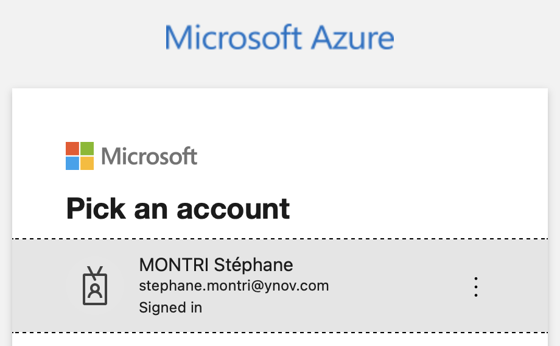
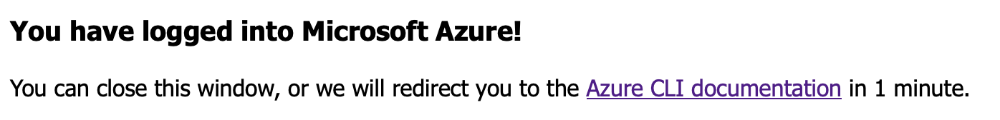

# Terraform sur Azure

1. **Authentification à Azure**

* Utilisez la commande `az login` dans le terminal pour s'authentifier à la souscription `Azure Student`.
* Une page s'ouvre dans votre navigateur pour vous connecter à la souscription `Azure Student`

* Une fois connectée, vous pouvez revenir sur le terminal

* Dans le terminal, sélectionnez la souscription 

